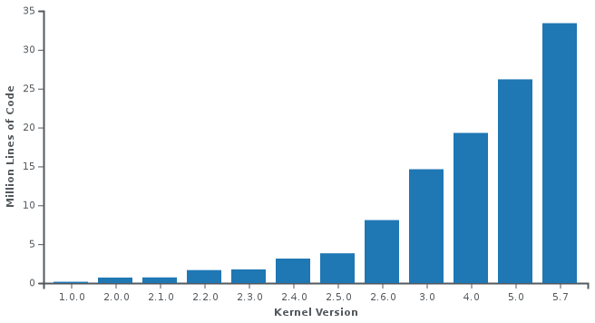
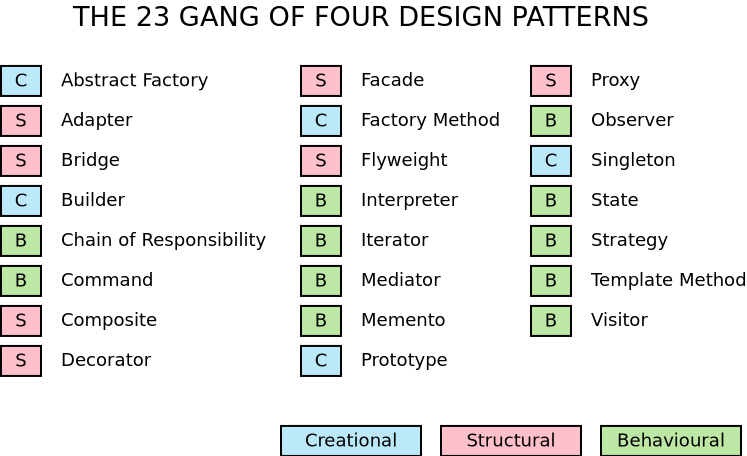

# Software Architecture

<!-- toc -->


## Growing software

Linux kernel - number of lines of code (forrás: [Wikipedia](https://en.wikipedia.org/wiki/Linux_kernel))



- [Why Linux’s biggest ever kernel release is really no big deal](https://www.linux.com/news/why-linuxs-biggest-ever-kernel-release-is-really-no-big-deal/)
    - Linux 5.8 features over 14,000 non-merge commits, some 800,000 new lines of code, and added around a hundred new contributors.


- [Teljesebb összehasonlítás](https://www.informationisbeautiful.net/visualizations/million-lines-of-code/)


- [Az autóipar tekintetében](https://www.linkedin.com/pulse/20140626152045-3625632-car-software-100m-lines-of-code-and-counting)

### The more, the better?

> if we wish to count lines of code, we should not regard them as "lines produced" but as "lines spent"
>
> E.W. Dijkstra [EWD 1036](https://www.cs.utexas.edu/users/EWD/transcriptions/EWD10xx/EWD1036.html)

***

> Every line of code written comes at a price: maintenance. To avoid paying for a lot of code, we build reusable software. The problem with code re-use is that it gets in the way of changing your mind later on.
>
> tef - [Write code that is easy to delete, not easy to extend](https://programmingisterrible.com/post/139222674273/write-code-that-is-easy-to-delete-not-easy-to)


## Complex Software


- [Software Complexity Is Killing Us](https://www.simplethread.com/software-complexity-killing-us/)
- [What is software complexity and how can you manage it?](https://carlalexander.ca/what-is-software-complexity/)

### How to measure? - Cyclomatic complexity

> *Cyclomatic complexity* measures the number of linearly independent paths through the method, which is determined by the number and complexity of conditional branches. A low cyclomatic complexity generally indicates a method that is easy to understand, test, and maintain. The cyclomatic complexity is calculated from a control flow graph of the method and is given as follows:
>
> cyclomatic complexity = the number of edges - the number of nodes + 1
>
> where a node represents a logic branch point and an edge represents a line between nodes.
>
> The rule reports a violation when the cyclomatic complexity is more than 25.
> 
> [CA1502: Avoid excessive complexity](https://docs.microsoft.com/hu-hu/visualstudio/code-quality/ca1502-avoid-excessive-complexity?view=vs-2015&redirectedfrom=MSDN)


<!--  -->

### Issues with cyclomatic complexity

- Not every statement is equal
    - `if`, `while`, `for` and `case` statements considered as identical
- Nesting
    - it doesn’t account for nesting

### NPATH complexity

> The NPath complexity of a method is the number of acyclic execution paths through that method. A threshold of 200 is generally considered the point where measures should be taken to reduce complexity.
>
> [NPathComplexity](http://phpmd.org/rules/codesize.html#npathcomplexity)

> Consider writing a unit test and you have a function with an NPath complexity of 16. This means that if you need want 100% code coverage you need to test for 16 possible outcomes and that would end up in pretty messy tests.
>
> Niklas Modess - [NPath complexity and cyclomatic complexity explained](https://modess.io/npath-complexity-cyclomatic-complexity-explained/)

<!-- ```java
//Cyclomatic Complexity = 3. Npath Complexity = 4.
public int compare(a, b) {
  if (a > b) {
    return a;
  } else {
    return b;
  }
}
```

Above code can be rewritten as below:

```java
//Cyclomatic Complexity = 2. Npath Complexity = 2.
public int compare(a, b) {
  if (a > b) {
    return a;
  }
  return b;
}
``` -->

- [Reducing Cyclomatic Complexity with Python](https://audiolion.github.io/python/2016/10/17/reducing-cyclomatic-complexity.html)
- [NPath complexity and cyclomatic complexity explained](https://modess.io/npath-complexity-cyclomatic-complexity-explained/)

### Complex vs. complicated

Michael Bykovski: [Simple vs. Complicated vs. Complex vs. Chaotic](https://medium.com/better-programming/simple-vs-complicated-vs-complex-vs-chaos-737b5964849d)

### Complexity: Accidental vs. Essential

> **Accidental Complexity** is something that can be simplified by a new idea, design, technique, procedure or approach. **Essential Complexity** is something that can't be simpler or something that loses value when it becomes simpler. Identifying the difference between accidental and essential complexity is a fundamental design technique.
>
> John Spacey - [Complexity: Accidental vs. Essential](https://simplicable.com/new/accidental-complexity-vs-essential-complexity)


## What is Software Architecture

> "Architecture" is a term that lots of people try to define, with little agreement. There are two common elements: One is the highest-level breakdown of a system into its parts; the other, decisions that are hard to change.
>
> Martin Fowler - Patterns of Enterprise Application Architecture

> All architecture is design but not all design is architecture. Architecture represents the significant design decisions that shape a system, where significant is measured by cost of change.
>
> Grady Booch

- [What is Software Architecture?](https://www.developerfusion.com/article/84899/what-is-software-architecture/)
- [The goals of Software Architecture](https://medium.com/docplanner-tech/the-goals-of-software-architecture-a3b0a0edeb0b)

## Miért kell ez?

> Architecture is the decisions that you wish you could get right early in a project 
>
> -- Ralph Johnson

- https://gbksoft.com/blog/why-you-need-a-software-architect-for-your-project/
- https://www.martinfowler.com/articles/designDead.html#SoIsDesignDead
- https://www.codeproject.com/Articles/1064240/Introduction-to-Software-Architecture


## Hogyan lesz egy ilyenünk?

<!-- goals requiremets contstraint -->

- [Practical Tips on Software Architecture Design, Part One](https://medium.com/@mbue/practical-tips-on-software-architecture-design-part-one-1c6bb0167157)
- [Practical Tips on Software Architecture Design, Part Two](https://medium.com/@mbue/practical-tips-on-software-architecture-design-part-two-37c2b61d7b6d)

### Architecture decision records

- [Why Write ADRs](https://github.blog/2020-08-13-why-write-adrs/)
- [néhány ADR sablon](https://github.com/joelparkerhenderson/architecture_decision_record)

Alább látható a Michael Nygard féle sablon: [Documenting Architecture Decisions](https://cognitect.com/blog/2011/11/15/documenting-architecture-decisions)

```markdown
# ADR template by Michael Nygard

This is the template in [Documenting architecture decisions - Michael Nygard](http://thinkrelevance.com/blog/2011/11/15/documenting-architecture-decisions).
You can use [adr-tools](https://github.com/npryce/adr-tools) for managing the ADR files.

In each ADR file, write these sections:

# Title

## Status

What is the status, such as proposed, accepted, rejected, deprecated, superseded, etc.?

## Context

What is the issue that we're seeing that is motivating this decision or change?

## Decision

What is the change that we're proposing and/or doing?

## Consequences

What becomes easier or more difficult to do because of this change?
```


## Design Principles


- [How to Learn Software Design and Architecture](https://khalilstemmler.com/articles/software-design-architecture/full-stack-software-design/)
    - fenti kép forrása
- [SOLID](./legacy_code.md#SOLID)
- [YAGNI](https://en.wikipedia.org/wiki/You_aren%27t_gonna_need_it)
    - "You aren't gonna need it"
    - > Always implement things when you actually need them, never when you just foresee that you need them.
       >
       > Ron Jeffries 
    - TDD

### 4C: Complete, Compliant, Clear, Concise

- [Four Cs for Flawless Agile Business Requirements](https://www.govwebworks.com/2017/05/01/four-cs-for-flawless-agile-business-requirements/)
- https://www.mojotech.com/blog/the-4cs-a-code-review-mnemonic/

<!-- ###

if two developer should think of the same answer for theri separete question, independently, it belongs in architecture

requirement engineering vs. software architecture
problématér beli definíció vs. probléma és megoldás között lépked, egyre alacsonyabb szintű problémát generálva oldja meg a magas szintűt

risk management: elemezzük a kockázatokat, kitaláljuk, hogy hogyan kezelnénk, majd minden módosítsnál felülértékeljük.

min 2 alternatíve leírva és átgondolva, hogy miért nem azokat választottuk
miért kérdésre a válaszra

https://sceweb.uhcl.edu/helm/RationalUnifiedProcess/process/modguide/md_sad.htm#Architectural%20Goals%20and%20Constraints -->


### <a href="https://en.wikipedia.org/wiki/Rob_Pike" data-wiki-lang="en" data-wiki-title="Rob Pike">Rob Pike</a>'s 5 Rules of Programming

1. You can't tell where a program is going to spend its time. Bottlenecks occur in surprising places, so don't try to second guess and put in a speed hack until you've proven that's where the bottleneck is.
2. Measure. Don't tune for speed until you've measured, and even then don't unless one part of the code overwhelms the rest.
3. Fancy algorithms are slow when n is small, and n is usually small. Fancy algorithms have big constants. Until you know that n is frequently going to be big, don't get fancy. (Even if n does get big, use Rule 2 first.)
4. Fancy algorithms are buggier than simple ones, and they're much harder to implement. Use simple algorithms as well as simple data structures.
5. Data dominates. If you've chosen the right data structures and organized things well, the algorithms will almost always be self-evident. Data structures, not algorithms, are central to programming.

Pike's rules 1 and 2 restate Tony Hoare's famous maxim "Premature optimization is the root of all evil." Ken Thompson rephrased Pike's rules 3 and 4 as "When in doubt, use brute force.". Rules 3 and 4 are instances of the design philosophy KISS. Rule 5 was previously stated by Fred Brooks in The Mythical Man-Month. Rule 5 is often shortened to "write stupid code that uses smart objects".

[forrás](http://users.ece.utexas.edu/~adnan/pike.html)


### Zen of Python[^1]

> The Zen of Python is a collection of 19 "guiding principles" for writing computer programs that influence the design of the Python programming language. [^2]

1. Beautiful is better than ugly.
2. Explicit is better than implicit.
3. Simple is better than complex.
4. Complex is better than complicated.
5. Flat is better than nested.
6. Sparse is better than dense.
7. Readability counts.
8. Special cases aren't special enough to break the rules.
9. Although practicality beats purity.
10. Errors should never pass silently.
11. Unless explicitly silenced.
12. In the face of ambiguity, refuse the temptation to guess.
13. There should be one-- and preferably only one --obvious way to do it.
14. Although that way may not be obvious at first unless you're Dutch.
15. Now is better than never.
16. Although never is often better than *right* now.
17. If the implementation is hard to explain, it's a bad idea.
18. If the implementation is easy to explain, it may be a good idea.
19. Namespaces are one honking great idea -- let's do more of those!

- [^1] [PEP 20](https://www.python.org/dev/peps/pep-0020/)
- [^2] [wiki://Zen of Python](https://en.wikipedia.org/wiki/Zen_of_Python)


### The 23 Gang of Four Design Patterns

[Teljes összefoglaló](http://www.blackwasp.co.uk/GofPatterns.aspx), ahol mindegyikhez van magyarázat, UML diagram és C# kód.

|                    |                                                                                  |                    |                                                                       |                    |                 |
|--------------------|----------------------------------------------------------------------------------|--------------------|-----------------------------------------------------------------|--------------------|-----------------|
|| [Abstract Factory](http://www.blackwasp.co.uk/AbstractFactory.aspx)              || [Facade](http://www.blackwasp.co.uk/Facade.aspx)                || [Proxy](http://www.blackwasp.co.uk/Proxy.aspx)           |
|| [Adapter](http://www.blackwasp.co.uk/Adapter.aspx)                               || [Factory Method](http://www.blackwasp.co.uk/FactoryMethod.aspx) || [Observer](http://www.blackwasp.co.uk/Observer.aspx)        |
|| [Bridge](http://www.blackwasp.co.uk/Bridge.aspx)                                 || [Flyweight](http://www.blackwasp.co.uk/Flyweight.aspx)          || [Singleton](http://www.blackwasp.co.uk/Singleton.aspx)       |
|| [Builder](http://www.blackwasp.co.uk/Builder.aspx)                               || [Interpreter](http://www.blackwasp.co.uk/Interpreter.aspx)      || [State](http://www.blackwasp.co.uk/State.aspx)           |
|| [Chain of Responsibility](http://www.blackwasp.co.uk/ChainOfResponsibility.aspx) || [Iterator](http://www.blackwasp.co.uk/Iterator.aspx)            || [Strategy](http://www.blackwasp.co.uk/Strategy.aspx)        |
|| [Command](http://www.blackwasp.co.uk/Command.aspx)                               || [Mediator](http://www.blackwasp.co.uk/Mediator.aspx)            || [Template Method](http://www.blackwasp.co.uk/TemplateMethod.aspx) |
|| [Composite](http://www.blackwasp.co.uk/Composite.aspx)                           || [Memento](http://www.blackwasp.co.uk/Memento.aspx)              || [Visitor](http://www.blackwasp.co.uk/Visitor.aspx)         |
|| [Decorator](http://www.blackwasp.co.uk/Decorator.aspx)                           || [Prototype](http://www.blackwasp.co.uk/Prototype.aspx)          |                    |                 |

<!--  -->


### Topologies

[Introduction to Software Architecture](https://www.codeproject.com/Articles/1064240/Introduction-to-Software-Architecture)

#### Layered Architechture


- [Layered Architecture: Introduction](http://serena-yeoh.blogspot.com/2013/06/layered-architecture-for-net.html)
- [Layered Architecture: Component Interactions](http://serena-yeoh.blogspot.com/2014/01/layered-architecture-components.html)

#### Message Bus Architecture


#### Server-Client Architecture


## C4 model

- [The C4 model for visualising software architecture](https://c4model.com/)
    - Context, Containers, Components and Code
- [The C4 Model for Software Architecture](https://www.infoq.com/articles/C4-architecture-model/)


### Level 1: System Context diagram

> Shows the software system you are building and how it fits into the world in terms of the people who use it and the other software systems it interacts with.
>
>  Simon Brown - [The C4 Model for Software Architecture](https://www.infoq.com/articles/C4-architecture-model/)

### Level 2: Container diagram

> Zooms into the software system, and shows the containers (applications, data stores, microservices, etc.) that make up that software system. Technology decisions are also a key part of this diagram.
>
>  Simon Brown - [The C4 Model for Software Architecture](https://www.infoq.com/articles/C4-architecture-model/)

### Level 3: Component diagram

> Zooms into an individual container to show the components inside it. These components should map to real abstractions (e.g., a grouping of code) in your codebase.
>
>  Simon Brown - [The C4 Model for Software Architecture](https://www.infoq.com/articles/C4-architecture-model/)

### Level 4: Code

> Finally, if you really want or need to, you can zoom into an individual component to show how that component is implemented.
>
>  Simon Brown - [The C4 Model for Software Architecture](https://www.infoq.com/articles/C4-architecture-model/)


## Versioning

### Semantic Versioning


- [website](https://semver.org)
- [Why I don't like SemVer anymore](https://snarky.ca/why-i-dont-like-semver/)
    - blogposzt az árnyoldalairól

### Calendar Versioning

- "*CalVer* is a versioning convention based on your project's release calendar, instead of arbitrary numbers."
- YYYY.MINOR.MICRO
- [website](https://calver.org)

### ZeroVer: 0-based Versioning

- "Your software's major version should never exceed the first and most important number in computing: zero."
- e.g.: **0.4.1**
- [website](https://0ver.org)


<!-- godbolt.org -->
<!-- https://nerds-den.com/how-to-design-software-that-you-can-be-proud-of/ -->