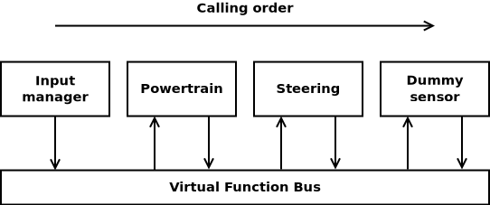

# Referencia architektúra

A repó található kezdeti kódot (skeleton) egységes alapot képez a félév során megvalósítandó szoftver számára, azonban nem kíván tökéletes és teljes megoldást biztosítani a feladat egyetlen elemére sem, mindösszesen példaként szolgál a következőkre:

- projekt struktúra
- grafikus felület létrehozása
    - Avalonia keretrendszerrel
- világmodell benépesítése
- vezérelt autó példányosítása és kiválasztása
- képfájl betöltése projektkönyvtárból
- világobjektumok rajzolása MVVM rendszerben
- vezérelt autó állapotának megjelenítése a műszerfalon
- ütemező használata
- billentyű lenyomás és felengedés esemény kezelése
- szenzor objektum létrehozása
- adatcsomag küldése és fogadása a *Virtual Function Bus*-on keresztül

## Virtual Function Bus

A VirtualFunctionBus (VFB) egy kommunikációs megoldás az AutomatedCar komponensei (SystemComponent) számára. A komponensek feliratkoznak a buszra és **a feliratkozás sorrendjében** ciklikusan meghívásra kerül a `Process()` metódusok.

Ebből következik, hogy a feliratkozást az ábrán látható sorrendben kell megtenni, mivel az adatáramlásnak ilyen irányultsága van. Az ábra a kód kezdeti állapotát szemlélteti, a munka során további modulok (szenzorok, vezetés támogató rendszerek) is csatlakoznak majd. Valamint a hajtáslánc és a kormányzás modult nem kötelező ennyire élesen szétválasztani.

<!--  -->

```plantuml
{{#include plantuml/dummy_sensor_vfb.puml}}
```

Minden adatközlő modulnak létre kell hoznia egy-egy csomag (packet) típust (és vele párhuzamosan egy az olvasást biztosító interfészt), amely tartalmazza azokat az információkat amelyeket továbbítania kell. Például az input modul a pedál és kormány állásokat. A hajtáslánc a következő, kiolvassa a pedál és váltó állást, számol vele, majd visszaírja a _saját_ csomagjába motor fordulatszámát és az autó sebességét, stb. Ezekre legközelebb a kormányzás modulnak lesz szüksége, az kiolvassa ugyanúgy mint az input modul kormányállás értékét, számol vele, majd visszaírja a autó adott iterációra vonatkozó elmozdulását.

### Használata általánosan

1. Create a new package (e.g. SteeringAnglePacket)
2. Create a new interface for it (e.g. IReadonlySteeringAnglePacket)
3. Add reference to the owner component (e.g. SteeringSystem)
4. Add the interface reference to the VirtualFunctionBus
5. In the loop method of the writing componenet set the payload value of the packet
6. In the loop method of the reading compontent read the payload of the packet

<!--
```mermaid
{{#include mermaid/class.mmd}}
```
-->

### Konkrét példán keresztül: DummySensor

A *DummySensor* egy rendkívül primitív „szenzor”: egyetlen feladata, hogy kiszámolja az egocar ás a *Circle* objektum közötti távolságot. Pontosabban az egocar és a kör referenciapont X, Y koordinátáinak különbségét. Azonban ez is teljes mérteékben képes bemutatni a szenzorok működését és a buszon keresztüli adatcserét.

A példa szempontjából releváns komponensek viszonyát alábbi ábra szemlélteti.

```plantuml
{{#include plantuml/skeleton_component.puml}}
```

A *World* singleton osztály tartalmaz minden *WorldObject*-et és tartalmaz referenciát a vezérelt autóra, amely közvetetten szintén *WorldObject*, csakúgy mint a *Circle*. Az *AutomatedCar* tartalmazza a *VirtualFunctionBus*-t, mivel ez az autó komponenseinek kommunikációs csatornáját valósítja meg. Szintén az *AutomatedCar* tartalmazza a szenzorokat, jelen esetben a *DummySensor*-t.

Ahhoz, hogy a szenzorok (vagy egyéb komponensek mint a hajtáslánc például) adatot cserélhessenek fel kell iratkozniuk a VFB-ra. Miután a feliratkozás megtörtént, a VFB minden ciklusában meghívja a `Porcess()` metódusát. A *DummySensor* esetében ez a metódus elkéri a világtól a *kör* objektumot, kiszámolja a vezérelt autó és a kör távolságát, majd ezt a távolságot eltárolja a *DummyPacket* objektumban (amely egy IReadOnlyDummyPacket típuson keresztül a VFB-ban van tárolva).

<!-- A szenzor része az *AutomatedCar*-nak, közvetlenül hozzáférhet a világhoz (*World*) mivel az singleton. Lekéri a világobjektumok közül a kört (*Circle*), majd kiszámolja a koordináták különbségét a `process()` metódusban és az eredményt eltárolja az `dummyPacket` változóban. -->

A `dummyPacket` referenciája eltárolásra került a *VirtualFunctionBus*ban, amely referenciáját a a szenzor konstruktorának biztosítani kell. Ehhez előzetesen létre kell hozni egy `IReadOnlyDummyPacket` típusú változót a VFB-ban.

Miután a `DummyPacket` megvalósítja az `IReadOnlyDummyPacket` interfészt, a VFB-ban az utóbbi típus tárolására szolgáló változó kerül deklarálásra. Ezzel biztosítható, hogy az adott értéket csak a csomag tulajdonosa (jelen esetben a *DummySensor*) tudja majd írni, de minden más komponens olvashatja a VFB-on keresztül.

```plantuml
{{#include plantuml/dummy_sensor_sequence.puml}}
```

Ez lejátszódik minden iterációban, így a kör és a vezérelt autó mindenkori helyzete szerinti távolságot fogja tartalmazni a *DummyPacket*.

Az alábbi ábra a *DummySensor* szenpontjából fontos osztályok kapcsolatát mutatja.

```plantuml
{{#include plantuml/dummy_sensor.puml}}
```

```plantuml
{{#include plantuml/automatedcar_class.puml}}
```

## Megjelenítés
