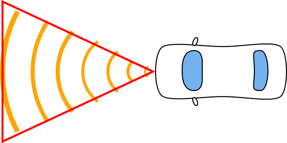
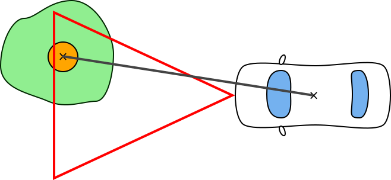

# Szenzorok

<!-- toc -->

A vezetéstámogató rendszerek 3 fő szenzorra épülnek: kamera, radar és ultrahang. A valóságban adott esetben a vezetéstámogató rendszerek több szenzor együttes használatával működnek (a szoftverben ilyet nem kell megvalósítani).

További olvasmány:

- [Driver Assistance Systems, an introduction to Adaptive Cruise Control](http://www.eetimes.com/document.asp?doc_id=1272754)
- [Sensor Set Design Patterns for Autonomous Vehicles](https://autonomous-driving.org/2019/01/25/positioning-sensors-for-autonomous-vehicles/)

## Kamera

A kamera a szélvédő mögött található, 60°-os látószöggel 80 méterre lát el. A [táblafelismerő rendszer](functions.md#t%C3%A1blafelismer%C5%91-traffic-sign-recognition---tsr) és a [sávtartó automatika](functions.md#s%C3%A1vtart%C3%B3-automatika-lane-keeping-assistant---lka) használja.

## Radar

A radar az autó lökhárítóján helyezkedik el, 60°-os látószöggel 200 méterre lát el. Az [adaptív tempomat](functions.md#adapt%C3%ADv-tempomat-adaptive-cruise-control---acc) és az [autonóm vészfékező rendszer](functions.md#auton%C3%B3m-v%C3%A9szf%C3%A9kez%C5%91-rendszer-automatic-emergency-brake---aeb) épül rá.

A valóságban a radar több járművet is azonosít. A azonos sávban közvetlenül előtte haladót, a szomszédos sávokban haladó autókat és a képes az azonos sávban haladó előttit is azonosítani (az autó alatt átverődő jelekkel). Ennek köszönhetően az olyan potenciálisan veszélyes manőverek mint a szomszéd sávból elénk bevágó autó is felismerhető mivel folyamatosan figyeli ezek helyzetét.

## Ultrahang

Az ultrahang szenzorból 8 darab van az autón, látótávolsága 3 méter, látószöge 100°, a [parkoló asszisztens](functions.md#parkol%C3%B3-asszisztens-parking-pilot---pp) és a [tolatóradar](functions.md#tolat%C3%B3radar) épül rá.

# Szenzorimplementáció működése

A valóságos szenzorokhoz képest az implemtálandó szenzorok jelentősen egyszerűbbek. Értelem szerűen nem kell sem radar, sem ultrahang jeleket szimulálni és a szenzorok látóterét is jelentősen egyszerűsítve reprezentáljuk: egy háromszöggel.

A szenzor látóterét jelképező háromszög a vezérelt autóhoz van rögzítve, vele együtt mozog. Ez az a háromszög amely kijelöli a világ egy szeletét és elérhetővé teszi a szenzornak feldolgozásra. Maga a világ (World osztály) singleton, pontosan egy létezik belőle amelyhez bármely szenzor közvetlenül hozzáfér.

A világ tartalmaz egy WorldObject objektumokból álló gyűjteményt, amelyben minden statikus és dinamikus objektum megtalálható, beleértve a vezérelt autót is.

Az első sprint során a modellező csapat implementál egy lekérdező metódust, amely egy háromszöget (vagy 3 pontot) vár bemenetként és visszadja azon világ objektumok listáját, amelyek beleesnek ebbe a háromszögbe.

Ha a szenzor háromszög ugyanolyan poligonnal van megvalósítva mint a világobjektumok poligonjai, akkor az `intersects` metódussal könynen eldöntehető, hogy a szenzor látóterének háromszövgébe tartozik-e egy-egy világ objektum.

A szenzorok ez a listát tovább szűrik az alapján, hogy mire érzékenyek. A kamerára a sávtartóautomatika (LKA) és a táblafelismerő (TSR) épül, így annak a szenzornak az útelemek és a táblák relevánsak.

A radar és az ultrahang olyan objektumokra érzékeny, amelynek neki lehet menni, amivel az egocar ütközhet. Ezen kívül a radarra épülő ACC a vezérelt autó előtt (sávon belül) haladó autóra fókuszál, a vészfékező (AEB) bármire ami az egocar útjába esik. Az ultrahang szenzor szintén, csupán az rövidebb távon és a Parking Pilot használja.

Miután a szenzorokhoz konkrét objektum referenciák kerülnek, a szenzor hozzáfér az objektum minden tulajdonságához. Így akár könnyedén lehet számítani távolságot két objektum között (a referenciapontok segítségével).

A szenzorok a feldolgozásuk eredményét a *Virtual Function Bus*-ra írják *packet* objektumok segítségével. Aztán ezeket a megfelelő modulok kiolvassák és hasznosítják. Pl. a műszerfalon megjelenik a táblafelismerő által detektált tábla, vagy az AEB által generált vezérlésre a hajtáslánc modul fékezéssel reagál.
