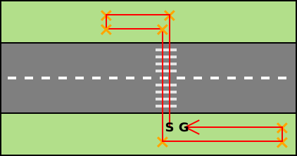
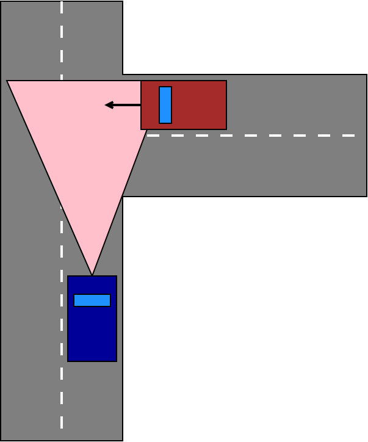

# 2. Sprint 

<!-- toc -->

## Ultrahang Szenzor implementálása

Az *ultrasonic sensor* modul felelőssége a parkoló automata alapjául szolgáló ultrahang szenzorcsomag szimulációjának implementálása. Mint minden szenzor, az ultrahang is érzékeli a világ egy szeletét és eléri a látóterében található objektumokat.

A valóságos és szimulált szenzorok működését részletesebben a [*Szenzorok*](sensors.md) fejezet mutatja be.

A modul bemenete tehát a világmodell, kimenete olyan ütközhető világ objektumok gyűjteménye képezi, amelyek beleesnek a szenzor látóterébe. A világ objektumainak lekérdezésére már léteznie kell egy publikus metódusnak, mely 3 pontot vár bemenetként és visszaadja a bele eső objektumokat. Ezekből kell még leválogatni a relevánsakat.
A szenzor látóterét 3 ponttal kel definiálni.

A kamera és a radar szenzorhoz képest a legfőbb különbség, hogy ultreahang szenzorból 8 példány kerül az autóra.
Minden példány látómezejének 3 pontját folyamatosan frissíteni kell az autó pozíciójának függvényében. Vagyis az autó egyébként folyamatosan frissülő referenciapontjához képest kell definiálni.
A megjelenítés is felhasználja ezeket a pontokat a háromszög kirajzolására a debuggoláshoz.


### Definition of Done

- 8 db ultrahang szenzor, egyenként 3 méter látótávolsággal, 100° látószöggel
- A 8 darab háromszög koordinátái az autó helyzetétől függően folyamatosan frissülnek
- A látószög és távolság által meghatározott területen kérjék el a **releváns** objektumokat
- Határozzák meg a legközelebbi (ütközés szempontjából) objektum pozícióját, kiterjedését, távolságát
    - külön-külön minden egyes szenzor, majd a rá épülő funkcionalitás fog ezekkel tovább dolgozni, tehát célszerű biztosítani a példányonként legközelebbi objektum továbbadását
- A legközelebbi objektum legyen vizuálisan kiemelve
    - a kiemelést a megjelenítés intézi az objektum tulajdonsága (kijelöltség) alapján, de azt, hogy éppen ki van-e jelölve a szenzornak kell az objektumon beállítani

<!-- - debug célra bekapcsolható módon ezek a háromszögek legyen kirajzolhatóak **zöld** színnel -->


## Kamera szenzor implementálása, Ütközés detekció (és mozgásállapot-változás szimuláció)

A kamera modul felelőssége a ávtartó automatika és táblafelismerő alapjául szolgáló kamera szenzor implementációja. Mint minden szenzor, a kamera is érzékeli a világ egy szeletét és eléri a látóterében található objektumokat.

A valóságos és szimulált szenzorok működését részletesebben a [*Szenzorok*](sensors.md) fejezet mutatja be.

A táblafelismerőnek csak továbbítani kell minden látott táblát, az majd eldönti, hogy melyik miképp releváns a vezérelt autóra nézve.

 A sávtartó automatika az összetettebb feladat, ugyanis meg kell tudni határozni a sávot (ebben segítenek az útelemk részét képező sávokat reprezentáló geometria objektumok). Tehát a világmodell már jól deiniált módon rendelkezésre bocsátja a sávinformációkat, de ezeket olyan adatstruktúrába kell rendezni, amely megkönnyíti a sávtartó automata implementálását: a sávtartó automatikának arra lesz majd szüksége, hogy az autó közelít-e a sávját meghatározó felfestésekhez, a sáv határait.

A modul bemenete tehát a világmodell, kimenetét olyan világ objektumok gyűjteménye képezi, amelyek beleesnek a szenzor látóterébe. A világ objektumainak lekérdezésére már léteznie kell egy publikus metódusnak, mely 3 pontot vár bemenetként és visszaadja a bele eső objektumokat. Ezekből kell még leválogatni a relevánsakat.
A szenzor látóterét 3 ponttal kel definiálni. Miután a szenzor kimenetét két küönböző típusú világobjektumokat igénylő funkció használja, a kimenete legyen ennek megfelően szétválasztva. Így a kimenet valójában két gyűjtemény, az egyik csupán táblákat, a másik útelemeket tartalmaz.

A szenzor látómezejének 3 pontját folyamatosan frissíteni kell az autó pozíciójának függvényében. Vagyis az autó egyébként folyamatosan frissülő referenciapontjához képest kell definiálni.
A megjelenítés is felhasználja ezeket a pontokat a háromszög kirajzolására a debuggoláshoz.


### Definition of Done

- 1 db, a szélvédő mögé elhelyezett kamera implementálása
- A látószög és távolság által meghatározott területen kérje el a **releváns** objektumokat
    - külön, a táblafelismerő szempontjából releváns objektumok, a táblák
    - külön, a sávtartó szempontjából releváns objektumok, az utak
- A háromszög koordinátái az autó helyzetétől függően folyamatosan frissülnek

<!-- - A szenzorok által relevánsnak tartott objektumok vizuálisan kiemelhetők egy debug kapcsolóval (billentyű vagy debug módba váltás) -->

<!-- - A kamera szenzor a látható sávok összes adatát visszaadja(hány sáv, melyikben vagyunk, azon belül milyen távolságra a szélektől)
- A kamera szenzor a látott táblák közül a legközelebbi összes adatát visszaadja (milyen tábla, milyen messzire van) -->

### Ütközés-detektálás

Folyamatosan vizsgálni kell, hogy a vezérelt autó nekiütközött-e egy ütközhető objektumnak. Ennek vizsgálatához használható a világobjektumok poligon váza. Később majd az automatikus vészfékező modul feladat lesz, hogy ez ne következhessen be.

- A vezérelt autó - tereptárgy ütközésének detektálása és esemény kiváltása
- A vezérelt autó - NPC-vel való ütközésének detektálása és esemény kiváltása
- Két objektum akkor ütközött amikor a poligon reprezántációjük összeért, nem amikor a képfájlok fedik egymást
    - pl. autó a fa lombkoronája alatt, de még nem érte el a törzset

### Mozgásállapot-változás szimuláció

- Az objektumok mozgásállapota az energiamegmaradás törvényeinek megfelelően változik (gyorsul, lassul, irányt vált, megáll)
    - Ha a vezérelt autó nekimegy egy NPC autónak akkor ez legyen rá hatással (lassuljon le)
    - Ha a vezérelt autó nagyobb sebességgel nekimegy egy „stabil” tereptárgynak (pl. fa), akkor álljon meg, érjen véget a játék, tekintsük úgy, hogy totálkáros.
         - egy táblán azonban át tud menni (el tudja sodorni), csak lassuljon le és sérüljön egy kicsit
- Az objektumok sérülnek, akár megsemmisülnek amennyiben túl nagy energiával ütköznek
- Ha a vezérelt autó elüt egy gyalogost, akkor érjen véget a játék
- A játék véget ér, ha a játékos ütközés(ek) következtében mozgásképtelenné válik (megsemmisül)
- Az NPC - NPC ütközés nem releváns
    - tehát NPC autó ha elüti a gyalogost, akkor nem kell, hogy végetérjen a játék


## Világ populálása mozgó NPC objektumokkal

A modul felelőssége, hogy az előző sprintben felépített világot, amelyben már megjelennek a statikus objektumok és van egy működő, vezethető autó, további dinamikus objektumokkal kell kiegészíteni. Ezek a nem játszható karakterek (NPC, _non player character_), amelyekre azért van szükség, hogy a 3. sprintes modulok tesztelhetők legyenek. Például a vészfékező rendszer nem üti el a gyalogost, vagy az adaptív tempomat igazítja az autó sebességét az előtte haladó autóéhoz.

A modul bemenete a világmodell, amely egyrészt elősegíti az implementálást azáltal, hogy a előre definiáll helyett az osztályhierarchiában az NPC objektumok számára, másrészt a statikus objektumok, egészen pontosan az út elemek definiálják a pályát amelyen az NPC autónak haladnia kell a KRESZ szabályai szerint: nem tér át az út másik oldalára, nem hajt gyorsan.

<!-- Alapvetően két megközelítés lehetséges az útvonalak definiálásához. Az egyik, hogy a pályaelemeket (amelyek nem a világban elfoglalt helyzetük alapján sorbarendezve kerülnek eltárolásra) sorba rendezzük, kijelölünk egy  -->

A legkézenfekvőbb megoldás, hogy a világban, a világ koordinátáira építve felveszünk vezérpontokat, amelyek kijelölnek egy utat. Ezeket célszerű nem a kódban, hanem valamilyen fájlban tárolni. Az NPC objektum pedig ezt az utat követni. Például a parkoló mellől indul az úton megy fölfele (csökken az y koordinátája) a kanyar előtt (x,y) világkoordinátákat elérve lelassul, (x,y)' koordináták elérése esetén elkezd kanyarodni, a sávból nem tér ki, majd (x,y)" koordinátáig halad a fönti egyenesen. És így tovább.




A mozgáshoz sebességet is kell társítani. Két vezérlőpont közötti egyenesen adott idő alatt kell az NPC-nek végighaladnia. Továbbá az egyes vezérlőpontokhoz forgatási műveletet is társítani kell. Ehhez egy mozgás leíró struktúra lesz szükséges, pl. az alábbi elnagyolt példa [TOML](https://toml.io/en/) nyelven, de bármilyen megoldás választható (JSON, XML, YAML vagy teljesen egyedi formátum):

```toml
[points]

[points.1]
x = 100
y = 200
rotation = 0
speed = 50 # px/s

[points.2]
x = 100
y = 100
rotation = 15
speed = 30 # px/s
```

A feladatban az igazi kihívás, hogy az NPC objektumok adaptálódjanak pályához. Az adaptálódást úgy lehet megkerülni, hogy mindkét pályához készül egy-egy útvonal.

Az NPC autónak nincs hajtáslánc modulja, nem szükséges olyan részletes mozgatás sem mint az vezérelt autónál, de azért a kanyarpontoknál legyen több lépésben megoldva, hogy fokozatosan legyen az autó elforgatva a kanyarodás valósághű leképezése céljából.


### Definition of Done:

- Objektumok előre definiált, értelmes helyen jelennek meg (autók úton, gyalogosok út mellett, a járda környékén)
- Objektumok előre szkriptelt útvonalat követnek
- Gyalogosok az út mentén haladnak, zebrán áthaladnak, megfordulnak majd újra átkelnek az úton
- Autók az utat - sávot - pontosan követik
- NPC objektumok egymás mozgásállapotát nem változtatják meg
    - Egy NPC autó gyalogoson akár átmehet, nem kell ütközésnek minősíteni
- Legalább egy autó végigmegy a pályán
- Legalább egy gyalogos mozog és átkel egy zebrán
- Új (a másik) pálya esetén az NPC objektumok adaptálódnak az új környezethez


## Radar szenzor

Az *radar sensor* modul felelőssége az adaptív tempomat és az automata vészfékező alapjául szolgáló radar szenzor szimulációjának implementálása. Mint minden szenzor, az ultrahang is érzékeli a világ egy szeletét és eléri a látóterében található objektumokat.

A valóságos és szimulált szenzorok működését részletesebben a [*Szenzorok*](sensors.md) fejezet mutatja be.

A modul bemenete tehát a világmodell, kimenetét olyan ütközhető világ objektumok gyűjteménye képezi, amelyek beleesnek a szenzor látóterébe. A világ objektumainak lekérdezésére már léteznie kell egy publikus metódusnak, mely 3 pontot vár bemenetként és visszaadja a bele eső objektumokat. Ezekből kell még leválogatni a relevánsakat.
A szenzor látóterét 3 ponttal kel definiálni.

A szenzor látómezejének 3 pontját folyamatosan frissíteni kell az autó pozíciójának függvényében. Vagyis az autó egyébként folyamatosan frissülő referenciapontjához képest kell definiálni.
A megjelenítés is felhasználja ezeket a pontokat a háromszög kirajzolására a debuggoláshoz.


A kihívás a komponenssel kapcsolatban, hogy nem elég egyszerűen csak visszadni a látótérben található releváns objektumokat, hanem el kell tudni dönteni, hogy a jelenlegi haladási irányunkat tartva veszélyesek-e. Pl. pontosan előttünk halad (a sávban), vagy oldalról érkezik és keresztezi az utunkat. A legközelebbi releváns objektum az alábbi ábrán az 1-es, a 2-es nem.


Itt arról van szó, hogy a a szenzor egy iterációjában megkapjuk a látótérbe került ütközhető objektumokat. Egy fa pl. jellegénél fogva statikus, tehát túlzottan sok figyelmet nem igényel, de ugyanúgy továbbítani kell mint egy autót. Az NPC autó esetében az adott iterációban ismert az autó helyzete, majd ezt össze kell vetni az előző iterációban ismert helyzetével. A kettőből meghatározható egy irányvektor és el lehet dönteni, hogy merre halad (ha halad egyáltalán), előttünk halad, vagy mellettünk (pl. másik sávban), stb. Az ACC az azonos sávban előttünk haladó autó sebességét veszi fel, ezért az autó haladási iránya fontos szempont.

<!-- nyomon kell követni őket és azonosítani az útvonalukat, ebből pedig meghatározni azt, hogy keresztezik-e a vezérelt autóét. -->

<!-- A vészfékezőnek reagálnia kell majd az akadályra, ha akkor is útban lesz-e még mire az autó odaér, ehhez szükséges az útban levő objektum távolsága és pozíciója (relatívan az autóhoz) -->
<!-- , ez minden ciklusban lefutva előállítja az objektum pl. gyalogos mozgásvektorát. 
Nem a radar, hanem majd a ráépülő funkció fogja ezekből meghatázorni, hogy pl. oldalról a vezérelt autó útjába tart-e egy objektum és ez veszélyt jelent-e rá. -->

<!--  -->

Mindez értelemszerűen egy statikus objektum pl. fa esetében is működik, csak az nem mozog (mert nem Középföldén vagyunk).

<!-- Az ACC-hez a radarnak el kell tudni dönteni, hogy pl. egy autó a vezérelt autó előtt halad-e. -->

### Definition of Done

- Elkészült 1 db, az autó első lökhárítója mögött elhelyezett radar szenzor
- A látószög (60°) és távolság (200m) által meghatározott területen kérjék el a **releváns** objektumokat
- A háromszög koordinátái az autó helyzetétől függően folyamatosan frissülnek
- Határozzák meg a legközelebbi, sávon belüli (lateral offset alapján) objektum helyzetét
- Az automata vészfékező számára releváns objektumok (az autó középvonala felé halad, látjuk) kiválogatása és visszaadása
- A legközelebbi objektum legyen vizuálisan kiemelve
    - a kiemelést a megjelenítés intézi az objektum tulajdonsága (kijelöltség) alapján, de azt, hogy éppen ki van-e jelölve a szenzornak kell az objektumon beállítani

<!-- - debug célra bekapcsolható módon a háromszög legyen kirajzolhatóak **piros** színnel -->
