# 3. Sprint

<!-- toc -->

## Parkoló automatika

A modul felelőssége az ultrahang szenzorokra épülő [_Parking Pilot_](functions.html#parkoló-asszisztens-parking-pilot---pp) vezetéstámogató funkció elkészítése.
Ennek feladata, hogy a megtalálja a parkolóban a megfelelő nagyságú szabad helyet, majd oda -- vezetői beavatkozás nélkül -- beparkolja az autót.

A parkolóig még a sofőr vezet, megáll az autósor mellett aktiváltja a parkolóhely keresést (bekapcsolja a PP-ot és kiteszi az irányjelzőt abba az irányba ahol a parkolót keresni kell), majd továbbra is "emberi" irányítással el kell haladni a parkolóhelyek mellett. Eközben a funkció kiszámolja a szabad hely méretét. Amikor megvan az alkalmas hely, akkor visszajelzést kell adni a sofőrnek és a hely dimenzióját és az autóhoz viszonyított helyzetét le kell tudni írni (és átadni a buszon, ha a manőver végrehajtását végző komponens el van választva a kereső komponenstől).

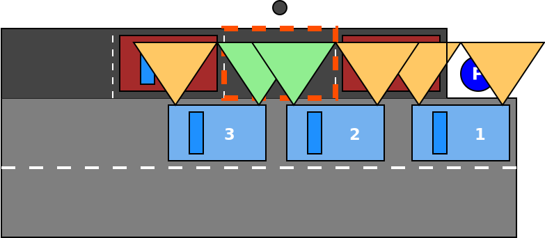

A parkolóhely a vezérelt autó (ennek ismert a szélessége és a hosszúsága) referenciapontjához viszonyítva legyen leírva. A parkolóhely hossza nem a felfestett parkolóhely hosszát jelenti. Egyrészt nem garantéált, hogy mindenki szabályosan parkol, másrészt azt nem is lehet az ultrahang szenzorral lemérni. Ehelyett két parkoló autó által szabadon hagyott helyet (amely akár két felfestésnyi is lehet) kell detektálni.

A szabad hely szélessége ha egyéb akadályt -- pózna (`bollard.png`) vagy fa -- nem tesztek külön emiatt, támpontként a pályára, akkor a szenzor látótávolsága, azaz 3 méter. A szabad helyhez egy referenciapontot kell (érdemes) társítani, pl. a helyet leíró téglalap bal felső pontja (ábrán így van) és az autó középpontjával és ezzel a ponttal (ebből számolható a távolság) valamint a hely dimenzióival kielégítően jellemezhető a parkoló hely.

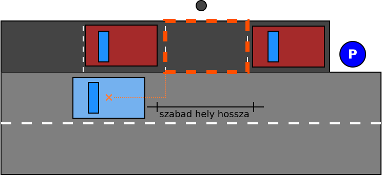

Miután a hely keresése során még a sofőr vezet, a „van szabad parkoló” jelzésre vélhetően nem egy előre definiált pozícióban állítja meg az autót. Ezért fontos, hogy a szaba hely mindig a vezérel autó pozíciójához képest legyen definiálva, mert a parkolási manőver kezdetéig esetleg valamennyit hátra hell majd tolatni.

Ezután, (ha más nem próbálgatásos módszerrel) ki kell tapasztalni, hogy a szükséges "párhuzamos parkolás" manőver hogyan vihető végbe a vezérelt autó irányítószerveivel, majd ezt le kell automatizálni: pl. le kell írni, kormány jobbra teker 100-ra, gáz 25% 1,5s-ig, majd kormány balra 75, gáz 20% 1.25s-ig. Ez hasonló az NPC objektumok szkripteléséhez.

A programozott vezérlést a buszon keresztül kapott szabad helyet leíró adatok függvényében kell elindítani (amelyhez szükséges lehet tehát egy előzetes tolatás is.

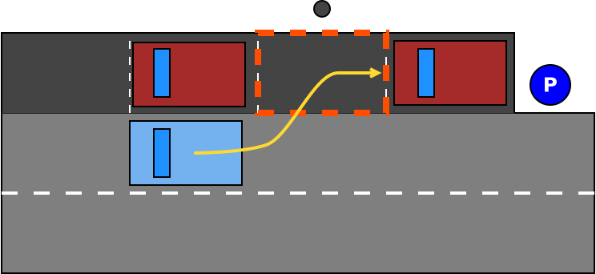

### Definition of Done

- Indexkapcsoló állása alapján parkolóhely keresés jobbra vagy balra
- Autó méretének megfelelő hely beazonosítása
- Megtalált parkoló jelzése, a hely információinak buszra írása (packet-tel)
- A parkolóhely megtalálásához szükséges NPC-k példányosítása
- A parkolás megkezdése külön inputhoz kötött (van erre vonatkozó gomb a műszerfalon, inputtól meg billentyűesemény)
- A kormány és gáz/fék vezérlésével beparkolás a talált helyre
- Párhuzamos parkolás sikeres (ütközés nélkül megtörténik)
- Sofőr beavatkozására (fék, gáz, kormány) kikapcsolás (megszűnik az automata vezérlés)

## Sávtartó automatika és táblafelismerés

A sávtartó automatika modul felelőssége a kamera szenzorra épülő [_Lane Keeping Assistant_](functions.html#sávtartó-automatika-lane-keeping-assistant---lka) funkció megvalósítása.

Ezt két alapvetően kétféleképpen lehet megoldani. Az egyik a sáv széleihez viszonyítva korrigál: ha az autó elérné a sáv szélét, akkor ellenkormányoz. A másik megoldás kiszámolja a sáv közepét és azon tartja az autót.

### 1. Sáv széleinek használata

Itt azt lehet vizsgálni, hogy a vezérelt autó jövőbeli helyzetében metszi-e a sávot.

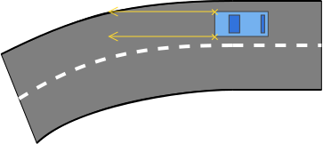

### 2. Sávközép használata

Itt a vezérelt autó középpontját lehet a sávközéphez igazítani.

Csak a 45 foknál enyhébb kanyarodású úton kell működnie, ilyenkor a kocsi a sáv szemmel látható közepét követi. Az LKA működése egy enyhe sávon belüli cikázást eredményez.

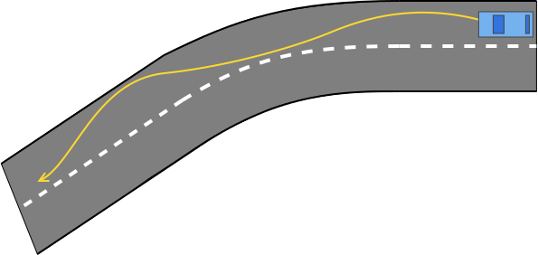

Az automatika számára kezelhetetlen forgalmi szituációkban (pl. éles kanyar, kereszteződés) el kell engednie a vezérlést és ezt a vezető tudtára kell hoznia. Legyen hozzá vizuális figyelmeztetés a műszerfalon (pl. LKA visszajelző sárga). Ha újra olyan útszakasz következik, ahol a funkció használható, akkor arról szintén legyen tájékoztatás.
Eze kívül természetese a funkció ki- és bekapcsolható.

A **Táblafelismerő** modul felelőssége a kamera szenzor látómezejébe kerülő körlekedési táblák közül kiválogatja a relevánsakat (csak az adott irányra/sávra vonatkozó) és a műszerfalnak átadja megjelenítésre az utolsó látott releváns táblát, továbbá beállítja a buszon az aktuális sebességkorlátozást, amelyet az adaptív tempomat modul használ majd. Ez debug információként jelenjen is meg a műszerfalon (szövegesen mint az X,Y koordináták).

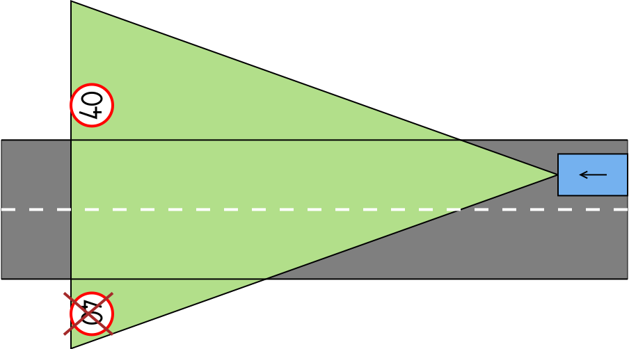

### Definition of Done

- A sávtartó automatika ki- és bekapcsolható
  - emberi beavatkozásra kikapcsol
- 45 foknál enyhébb kanyarodású úton a kocsi a sáv szemmel láthatóan a sáv közepén marad
- Ha el kell engednie a kontrollt (az automatika számára kezelhetetlen forgalmi szituáció következik, pl. éles kanyar, kereszteződés), vizuális figyelmeztetést ad
- Ha újra elérhető a funkció (pl. elhagytuk a kanyart) vizuális indikáció (a műszerfalon)

Táblafelismerő:

- az utolsó látott, releváns tábla megjelenik a műszerfalon
- az utolsó sebességkorlátozás kiírásra kerül a buszra
  - és megelenik debug információként a műszerfalon

## Adaptív tempomat

A modul felelőssége a radar szenzorra épülő [_adaptív tempomat_](functions.html#adaptív-tempomat-adaptive-cruise-control---acc) vezetéstámogató funkció elkészítése. Ennek a funkciónak három felhasználói esetet kell lefedie.

1. Felhasználó által beállított sebesség tartása
2. A táblafelismerő által közölt sebességkorlátozás betarzása
3. Az előttünk haladó (NPC) autó sebességének felvétele és egy (időben definiálist) beállított követési távolság tartása
   - Valójában ettől lesz adaptív

Az egyes ponthoz szükséges kezelőszervek már elkészültek az első sprintben és a funkcióhoz szükséges bemeneti értékek már a buszon keresztül elérhetőek. A modulnak szabáályoznia kell a hajtásláncot, hogy ne léphesse túl a beállított sebességet. Ehhez olyan inputot kel biztosítania mintha az a billantyűzetről érkezne, de a tényleges vezeői input felülírja őket.

A kettes pont egy harmadik sprintes (tehát aktuálisan készülő funkciótól függ), azonban könynen visszavezethető az első pontra. A közúti szabályozást magasabb prioritásúnak kell minősíteni. Tehát a felhasználó pl. beállít egy 70 km/h-ás célsebességet, majd érkezik egy kérés a táblafelismerőtől, hogy 50km/h a megengedett, akkor azt kell figyelembe venni.

A hármas pont egy második sprintes modultól, az NPC autók meglététől függ. Az előttünk haladó sebességéhez való igazodás a legmagasabb prioritású, hiszen hiába szeretne a vezető 70-el haladni, mikor a tábla szerint 50-nel lehet, de ha az előttünk haladó mindössze 40-el halad, akkor ahhoz kell igazodni, különben nekiütközünk.
Oda kell figyelni, hogy csak a sávban előttünk haladó autót vegye figyelembe, a szembejövőt ne.

A követési _távolság_ időben törtéánő megadása azt jelenti, hogy a beállított (pl.) 1 másodperces követés esetén akkora távolságot kell hagyni, hogy **az aktuális sebességgel** haladva 1 másodperc alatt megtett út legyen a távolság: 10 m/s (36 km/h) esetében 10 méter. Ezen érték beállítására már az első sprintben készült vezérlő.

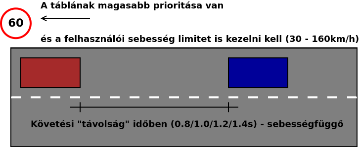

### Definition of Done

- Ki- és bekapcsolható
- Bekapcsoláskor a célsebessége az aktuális sebesség, de a minimum célsebesség 30 km/h
- Ha nincs saját sávban előttünk autó, akkor a vezérelt autó tartja a kiválasztott célsebességet
- Ha a saját sávban található autó:
  - Ha az előttünk levő autó lassabb, akkor fel kell venni a sebességét
  - Ha gyorsabb, akkor tartja a kiválasztott sebességet
- Fékezésre kikapcsol
- AEB beavatkozásra kikapcsol
- Ha speed limitet talál a buszon, azt alkalmazza új célsebességként, amíg a sofőr felül nem írja

## Vészfékező

A modul felelőssége a radar szenzorra épülő [automata vészfékező rendszer](functions.html#autonóm-vészfékező-rendszer-automatic-emergency-brake---aeb) megvalósítása. A vészfékező kritikus biztonsági funkció, így nem kapcsolható ki manuálisan, de maximum 70 km/h sebességig működik. A működése két esetre bontható: ütközés statikus vagy dinamikus objektummal.

Az előbbi az egyszerűbb eset, mivel a veszélyt jelentő objektum pozíciója változatlan.

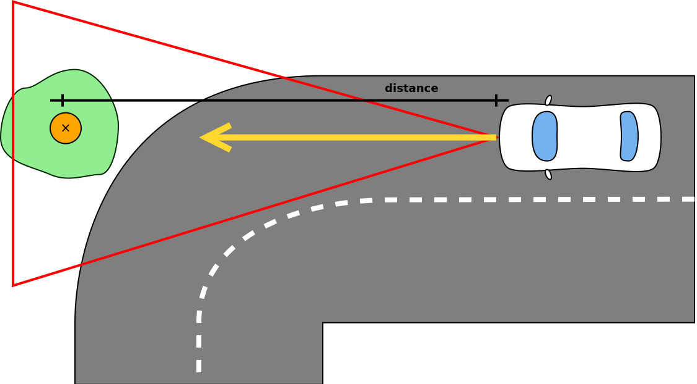

El kell döntani, hogy az autó az aktuális irányvektort figyelembe véve ütközni fog-e az objektumal. Ha igen, az autó ismert sebességét figyelembe véve kiszámolható, hogy ehhez mennyi időre van szükség és, hogy mekkora mértékű lassulás kell ehhez.

A radar visszaadja az autó előtt levő legközelebbi releváns objektum adatait (táv, sebesség), ezekkel lehet számolni. A távolságból és az autó sebességéből meghatározható, hogy milyen lassulást kell adni az autónak, hogy még megálljon, de ne lépje túl a \\( 9 m/s^2 \\)-et.

Ha az ütközés elkerülhető, vizuális figyelmeztetést kell elhelyezni a vezetőnek, hogy fékezzen. Ha nem reagál, azaz továbbra is ütközési pályán vagyunk és már csak vészfékezéssel kerülhető el az ütkzés, akkor a hajtásláncnak vészfékezési inputot kell adni. Ez a maximálisan megengedett, \\( 9 m/s^2 \\)-es lassulást (ennél nagyobb lassulás veszélyes az utasokra), akkor

Ha más nem próbálgatással meg kell határozni, hogy adott sebességről egy maximális fékezési input (100% pedál állás) mennyi idő alatt fékezi állóra az autót.
A modul olyan triggerekkel vezérli az autót mint amilyenek a billentyűlenyomás kezelőtől jönnek (fékpedál állás).

Dinamikus objektumok esetében a vészfékezés elve azonos, de az ütközési pálya meghatározása összetettebb.

Másik sávban szembe jövő autóra nem kell vészékezni, tehát el kell tudni dönteni, hogy abban az esetben nincs ütközési pálya.

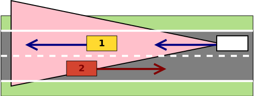

### Definition of Done

- Elkerülhető ütközés esetén vizuális figyelmeztetés a sofőrnek
- Ha a sofőr nem avatkozik közbe, automatikus fékezés (az utolsó pillanatban, ahol az ütközés még elkerülhető)
- Az automatikus fékezés mértéke a sebességgel arányos, de nem lehet \\( 9 m/s^2 \\)-nél nagyobb
- 70 km/h felett figyelmeztetés, hogy az AEB nem tud minden helyzetet kezelni
- A vezérelt autó nem üt el gyalogost, nem megy neki fának
- Nem releváns objektumok esetében (fals pozitív) mint a szembejövő autó nem történik vészfékezés

## Tolatóradar / Tolatókamera

A modul felelőssége a hátsó két ultrahang szenzorra épülő tolatóradar (és kamera) implementálása, amely visszajelzést ad a vezetőnek, arról, hogy tolatás közben veszélyesen közelre került-e valamilyen objektumhoz.
A távolság számoláshoz itt is lehet használni az objektum referenciákat, az objektum koordinátái közvetlenül elérhetőek, de ne az objektum közepéhez, hanem értelem szerűen annak széléhez képest legyen kiszámolva a távolság.

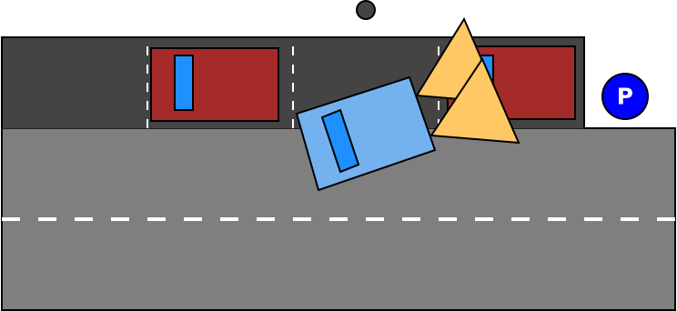

Hozzá tartozó GUI, Valami ehhez hasonlóként lehet elképzelni: [YouTube videó](https://www.youtube.com/watch?v=qZkCoDChS4A). A bal- és jobboldali szenzor legközelebbi objektumának értéke külön-külön kerüljön megjelenítésre.

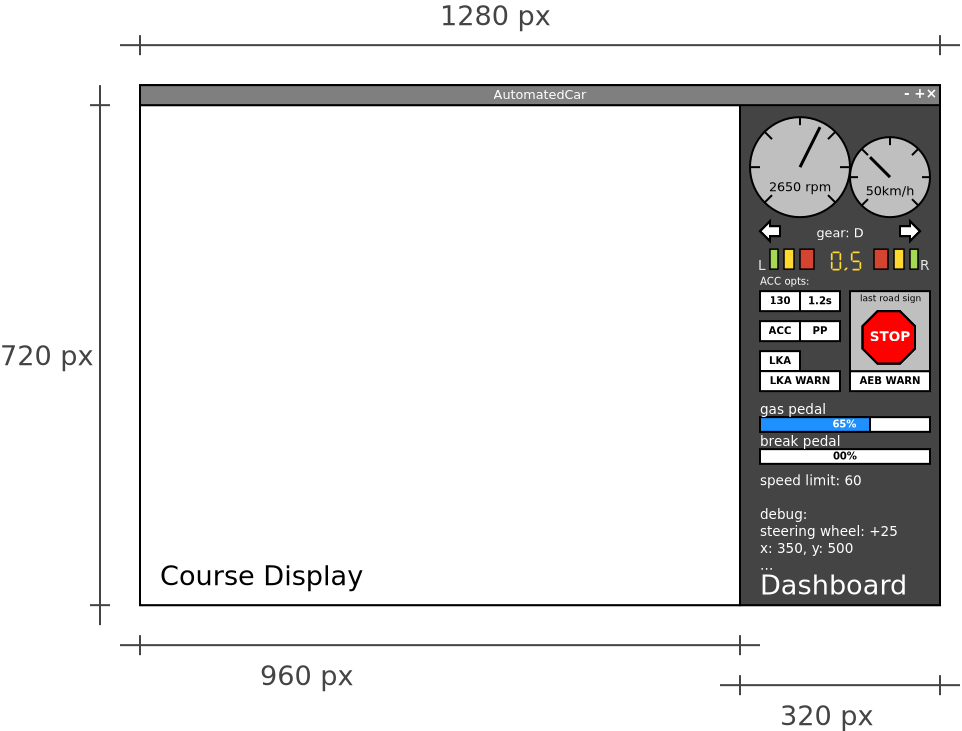

A tolató radar mellé legyen a tolatókaerák távolságkijelzése is megvaólsítva a pályamegjelenítőjén, három lépcsóban 0.5m piros, utána 1m sárga majd az autó hosszáig zöld. Ez hátramenetben kerüljön megjelenítésre, nem debug-funkcióként.

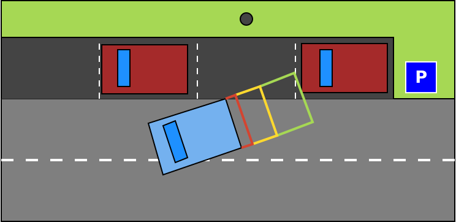

### Definition of Done

- a tolatóradar csak hátramenetben aktív
- figyelmeztetés megjelenítése a műszerfalon 3 fokozatban
  - nincs akadály (zöld)
  - közel van akadály: 0.8m-en belül (sárga)
  - nagyon közel van akadály 0.4m-en belül (piros)
- távolság megjelenítése a műszerfalon
- távolságok kirajzolása a képernyőre
  - az autó pozíciójához képest folyamatosan frissül
  - hátramenetben mindig látszik (nem debug funkció)

Korábbi implementáció (ekkor csak a műszerfalas visszajelzés volt feladat):

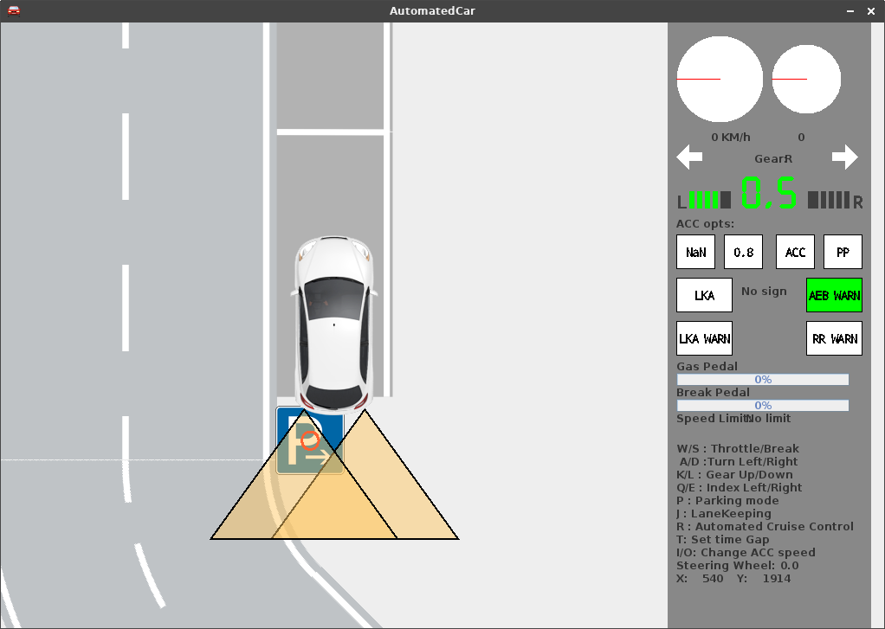
